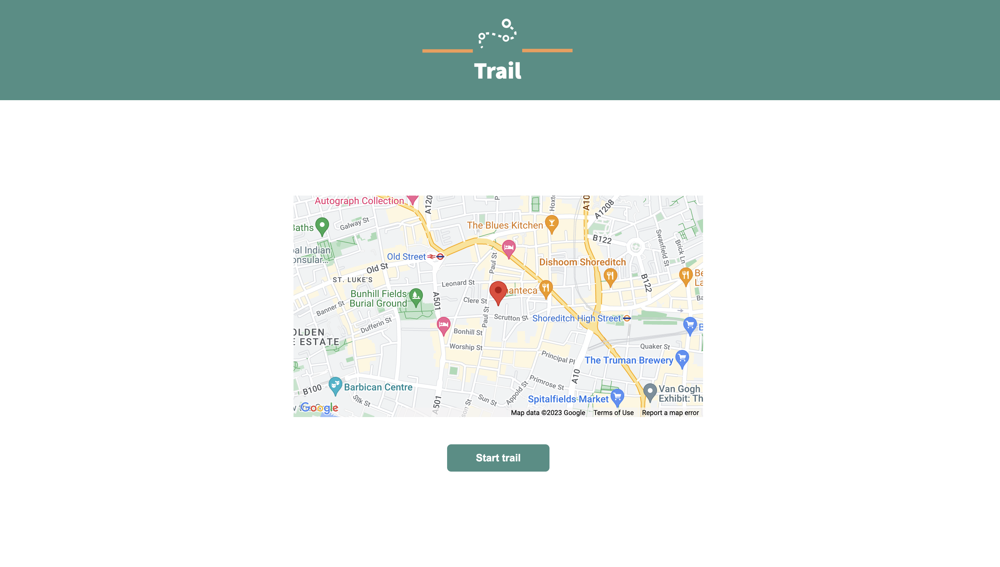
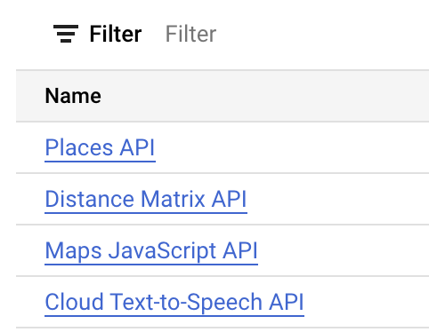

# trail-public
An app to discover the world around you

website: https://trail.net



## Build Instructions

- Clone repo to local machine
  
  ### Create Google Cloud API Key
- Go to https://cloud.google.com/ and create/login to your account
- Navigate to APIs and Services
- Create a new project and enable Places API, Distance Matrix API, Maps Javascript API and Cloud Text-To-Speech API


  
- Navigate to credentials and click `create credentials` and generate an API Key.
- Generate a service account key. Instructions here: https://www.youtube.com/watch?v=naZ8oEKuR44
- Download file containing the key.

  ### Create OpenAI Key
- Head to https://openai.com/ and create an account.
- Login and click on the profile icon in the top right. Follow the instructions to generate an API key

  ### Create environment vairables

- Open a terminal window and ```cd``` into the directory you downloaded
- run
  ```
  export GOOGLE_API_KEY=<insert key here>
  export OPENAI_KEY=<insert key here>
  export TextToSpeech_KEY=<insert RELATIVE PATH to key file here>
  ```

  ### Install dependencies and run
  
- ```cd``` into ```api``` and run ```npm install```
- Once install is complete, run ```cd bin``` and then ```node www.js```
- Leave that terminal open and open a new terminal in the root directory of the project.
- run ```cd frontend```
- run ```npm install```
- Once install is complete, run ```npm run dev```
- In the browser, open http://localhost/5173
